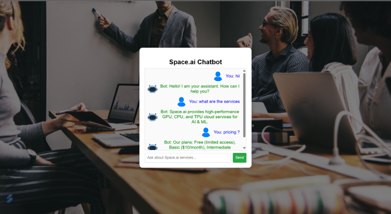

### **📄 README.md - Space.ai Chatbot Assistant**  
---


## 🚀 **Project Title:** Space.ai Chatbot Assistant  
A smart chatbot assistant designed for **Space.ai**, a fictional company that offers **GPU**, **CPU**, and **TPU** services for **AI** and **ML** tasks. This chatbot combines **Rule-Based Logic** and **LLM (Large Language Model)** to provide intelligent and efficient customer support.  

---

## 📋 **Project Overview**  
This chatbot efficiently handles customer inquiries using:  

✅ **Rule-Based Responses** for common, predefined questions.  
✅ **LLM Integration** (Llama-3) to answer complex or unexpected queries.  
✅ **User Interface** built with **Flask** and **HTML/CSS/JS** for interactive conversation.  

---

## 🧬 **Features**  
🔹 Provides instant answers to frequently asked questions (FAQs).  
🔹 Handles flexible language inputs using LLM.  
🔹 Displays chat interface with user and bot avatars.  
🔹 Offers secure storage for API keys using `.env` or `config.py`.  
🔹 Includes a visually appealing background with a dark overlay.  

---

## 🖡️ **Tech Stack**  
- **Python** (Flask for web framework)  
- **HTML/CSS/JavaScript** (Frontend for chatbot UI)  
- **Togther.ai API** (meta-llama/Llama-3.3-70B-Instruct-Turbo-Free)  
- **Rule-Based Logic** (For common Space.ai questions)  

--- 

## Screenshot

  

---

## 💬 **Usage Instructions**  
1. Ask predefined questions like:  
   - "What are your services?"  
   - "What are your pricing plans?"  
   - "How do I contact support?"  

2. For unexpected queries or complex questions, the **LLM** will intelligently respond.  

---

## 🛡️ **Security Best Practices**  
✅ Use `.env` or `config.py` to store sensitive data like API keys.  
✅ Add `.gitignore` to prevent committing secrets or unwanted files.  

---

## 🛠️ **Project Structure**  
```txt
📂 space-ai-chatbot
 ├── 📂 static
 │   ├── styles.css
 │   ├── bg-image.jpg
 │   ├── bot.png
 │   └── user.png
 ├── 📂 templates
 │   └── index.html
 ├── app.py
 ├── filter.py
 ├── llm_integration.py
 ├── config.py
 ├── .gitignore
 └── README.md
```

---

## 🤖 **Future Enhancements**  
🔹 Improve LLM prompt engineering for better conversational flow.  
🔹 Add multilingual support for global reach.  
🔹 Integrate database storage for customer inquiries.  
🔹 Develop an admin dashboard for insights and analytics.  

---


